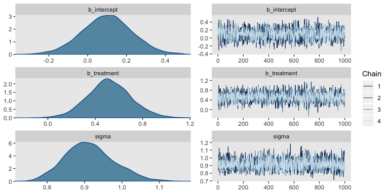

Bayesian power analysis: Part I
================

## tl;dr

If you’d like to learn how to do Bayesian power calculations using
**brms**, stick around for this 5-part blog series. Here with part I,
we’ll set the foundation.

## Power is hard, especially for Bayesians.

Many journals, funding agencies, and dissertation committees require
power calculations for your primary analyses. Frequentists have a
variety of tools available to perform these calculations (e.g.,
[here](https://rpsychologist.com/analytical-and-simulation-based-power-analyses-for-mixed-design-anovas)).
Bayesians, however, have a more difficult time of it. Most of our
research questions and data issues are sufficiently complicated that we
cannot solve the problems by hand. We need Markov chain Monte Carlo
methods to iteratively sample from the posterior to summarize the
parameters from our models. Same deal for power. If you’d like to
compute the power for a given combination of \(N\), likelihood
\(p(\text{data} | \theta)\), and set of priors \(p (\theta)\), you’ll
need to simulate.

It’s been one of my recent career goals to learn how to do this. You
know how they say: *The best way to learn is to teach*. This series of
blog posts is the evidence of me learning by teaching. It will be an
exploration of what a Bayesian power simulation workflow might look
like. The overall statistical framework will be **R**, with an emphasis
on code style based on the [**tidyverse**](https://www.tidyverse.org).
We’ll be fitting our Bayesian models with Bürkner’s
[**brms**](https://github.com/paul-buerkner/brms).

What this series is not, however, is an introduction to statistical
power itself. Keep reading if you’re ready to roll up your sleeves, put
on your applied hat, and learn how to get things done. If you’re more
interested in introductions to power, itself, see the references in the
next section.

## I make assumptions.

For this series, I’m presuming you are familiar with linear regression,
familiar with the basic differences between frequentist and Bayesian
approaches to statistics, and have a basic sense of what we mean by
statistical power. Here are some resources if you’d like to shore up.

  - To learn about Bayesian regression, I recommend the introductory
    text books by either McElreath ([here](\(%5Bhere%5D\(\)\))) or
    Kruschke
    ([here](http://www.indiana.edu/~kruschke/DoingBayesianDataAnalysis/)).
    Both authors host blogs
    ([here](http://doingbayesiandataanalysis.blogspot.com) and
    [here](http://elevanth.org/blog/), respectively). If you go with
    McElreath, do check out his [online
    lectures](https://www.youtube.com/channel/UCNJK6_DZvcMqNSzQdEkzvzA/playlists)
    and [my project](https://bookdown.org/connect/#/apps/1850/access)
    translating his text to **brms** and **tidyverse** code. I’m working
    on a [similar
    project](https://github.com/ASKurz/Doing-Bayesian-Data-Analysis-in-brms-and-the-tidyverse)
    for Kruschke’s text, but it still has a ways to go before I release
    it in full.
  - If you’re unfamiliar with statistical power, Kruschke covered it in
    chapter 13 of his text. You might also check out [this review
    paper](https://www3.nd.edu/~kkelley/publications/articles/Maxwell_Kelley_Rausch_2008.pdf)
    by Maxwell, Kelley, and Rausch. There’s always, of course, the
    original work by Cohen (e.g.,
    [here](https://www.worldcat.org/title/statistical-power-analysis-for-the-behavioral-sciences/oclc/17877467)).
  - For even more **brms**-related resources, you can find vignettes and
    documentation
    [here](https://cran.r-project.org/web/packages/brms/index.html).
  - For **tidyverse** introductions, your best bets are
    [*R4DS*](https://r4ds.had.co.nz) and [*The tidyverse style
    guide*](https://style.tidyverse.org).
  - We’ll be simulating data. If that’s new to you, both Kruschke and
    McElreath cover that a little in their texts. You can find nice
    online tutorials
    [here](https://debruine.github.io/tutorials/sim-data.html) and
    [here](https://aosmith.rbind.io/2018/08/29/getting-started-simulating-data/),
    too.
  - We’ll also be making a couple custom functions. If that’s new, you
    might check out [*R4DS*, chapter
    19](https://r4ds.had.co.nz/functions.html) or
    [chapter 14](https://bookdown.org/rdpeng/rprogdatascience/functions.html)
    of Roger Peng’s *R Programming for Data Science*.

## We need to warm up before jumping into power.

Let’s load our primary statistical packages.

``` r
library(tidyverse)
library(brms)
library(broom)
```

Consider a case where you have some dependent variable \(Y\) that you’d
like to compare between two groups, which we’ll call treatment and
control. Here we presume \(Y\) is continuous and, for the sake of
simplicity, is in a standardized metric for the control condition.
Letting \(c\) stand for control and \(i\) index the data row for a given
case, we might write that as \(y_{i, c} \sim \text{Normal} (0, 1)\). The
mean for our treatment condition is 0.5, with the standard deviation
still in the standardized metric. In the social sciences a standardized
mean difference of 0.5 would typically be considered a medium effect
size. Here’s what that’d look
like.

``` r
# set our theme because, though I love the default ggplot theme, I hate gridlines
theme_set(theme_grey() +
            theme(panel.grid = element_blank()))

# define the means
mu_c <- 0
mu_t <- .5

# set up the data
tibble(x = seq(from = -4, to = 5, by = .01)) %>%
  mutate(c = dnorm(x, mean = mu_c, sd = 1),
         t = dnorm(x, mean = mu_t, sd = 1)) %>% 
  
  # plot
  ggplot(aes(x = x, ymin = 0)) +
  geom_ribbon(aes(ymax = c),
              size = 0, alpha = 1/3, fill = "grey25") +
  geom_ribbon(aes(ymax = t),
              size = 0, alpha = 1/3, fill = "blue2") +
  geom_text(data = tibble(x = c(-.5, 1),
                          y = .385,
                          label = c("control", "treatment"),
                          hjust = 1:0),
            aes(y = y, label = label, color = label, hjust = hjust),
            size = 5, show.legend = F) +
  scale_x_continuous(NULL, breaks = -4:5) +
  scale_y_continuous(NULL, breaks = NULL) +
  scale_color_manual(values = c("grey25", "blue2"))
```

<!-- -->

Sure, those distributions have a lot of overlap. But their means are
clearly different and we’d like to make sure we plan on collecting
enough data to do a good job showing that. A power analysis will help.

Within the conventional frequentist paradigm, power is the probability
of rejecting the null hypothesis \(H_0\) in favor of the alternative
hypothesis \(H_1\), given the alternative hypothesis is true. In this
case, the typical null hypothesis is

\[H_0\text{: } \mu_c = \mu_t,\]

or put differently

\[
H_0\text{: } \mu_t - \mu_c = 0.
\]

And the alternative hypothesis is often just

\[H_1\text{: } \mu_c \neq \mu_t,\]

or otherwise put

\[
H_1\text{: } \mu_t - \mu_c \neq 0.
\]

Within the regression framework, we’ll be comparing \(\mu\)s using the
formula

\[
\begin{align*}
y_i & \sim \text{Normal} (\mu_i, \sigma) \\
\mu_i & = \beta_0 + \beta_1 \text{treatment}_i,
\end{align*}
\]

where \(\text{treatment}\) is a dummy variable coded 0 = control 1 =
treatment and varies across cases indexed by \(i\). In this setup,
\(\beta_0\) is the estimate for \(\mu_c\) and \(\beta_1\) is the
estimate of the difference between condition means, \(\mu_t - \mu_c\).
Thus our focal parameter, the one we care about the most in our power
analysis, will be \(\beta_1\).

Within the frequentist paradigm, we typically compare these hypotheses
using a \(p\)-value for \(H_0\) with the critical value, \(\alpha\), set
to .05. Thus, power is the probability we’ll have \(p < .05\) when it is
indeed the case that \(\mu_c \neq \mu_t\). We won’t actually be
computing \(p\)-values in this project, but we will use 95% intervals.
Recall that the result of a Bayesian analysis, the posterior
distribution, is the probability of the parameters, given the data
\(p (\theta | \text{data})\). With our 95% Bayesian credible intervals,
we’ll be able to describe the parameter space over which our estimate of
\(\mu_t - \mu_c\) is 95% probable. That is, for our power analysis,
we’re interested in the probability our 95% credible intervals for
\(\beta_1\) contain 0 within their bounds when we know a priori
\(\mu_c \neq \mu_t\).

The reason we know \(\mu_c \neq \mu_t\) is because we’ll be simulating
the data that way. What our power analysis will help us determine is how
many cases we’ll need to achieve a predetermined level of power. The
conventional threshold is .8.

### Dry run number 1.

To make this all concrete, let’s start with a simple example. We’ll
simulate a single set of data, fit a Bayesian regression model, and
examine the results for the critical parameter \(\beta_1\). For the sake
of simplicity, let’s keep our two groups, treatment and control, the
same size. We’ll start with \(n = 50\) for each condition.

``` r
n <- 50
```

We already decided above that

\[
\begin{align*}
y_{i, c} & \sim \text{Normal} (0, 1) \text{ and}\\
y_{i, t} & \sim \text{Normal} (0.5, 1).
\end{align*}
\]

Here’s how we might simulate data along those lines.

``` r
set.seed(1)

d <-
  tibble(group     = rep(c("control", "treatment"), each = n)) %>% 
  mutate(treatment = ifelse(group == "control", 0, 1),
         y         = ifelse(group == "control", 
                            rnorm(n, mean = mu_c, sd = 1),
                            rnorm(n, mean = mu_t, sd = 1)))

glimpse(d)
```

    ## Observations: 100
    ## Variables: 3
    ## $ group     <chr> "control", "control", "control", "control", "control",…
    ## $ treatment <dbl> 0, 0, 0, 0, 0, 0, 0, 0, 0, 0, 0, 0, 0, 0, 0, 0, 0, 0, …
    ## $ y         <dbl> -0.62645381, 0.18364332, -0.83562861, 1.59528080, 0.32…

In case it wasn’t clear, the two variables `group` and `treatment` are
redundant. Whereas the former is composed of names, the latter is the
dummy-variable equivalent. The main event was how we used the `nrorm()`
function to simulate the normally-distributed values for `y`.

Before we fit our model, we need to decide on priors. To give us ideas,
here are the **brms** defaults for our model and data.

``` r
get_prior(data = d,
          family = gaussian,
          y ~ 0 + intercept + treatment)
```

    ##                 prior class      coef group resp dpar nlpar bound
    ## 1                         b                                      
    ## 2                         b intercept                            
    ## 3                         b treatment                            
    ## 4 student_t(3, 0, 10) sigma

A few things: Notice that here we’re using the `0 + intercept` syntax.
This is because **brms** handles the priors for the default intercept
under the presumption you’ve mean-centered all your predictor variables.
However, since our `treatment` variable is a dummy, that assumption
won’t fly. The `0 + intercept` allows us to treat the model intercept
as just another \(\beta\) parameter, which makes no assumptions about
centering. Along those lines, you’ll notice **brms** currently defaults
to improper flat priors for the \(\beta\) parameters (i.e., those for
which `class = b`). And finally, the default prior on \(\sigma\) is a
permissive `student_t(3, 0, 10)`. By default, **brms** also sets the
left bounds for \(\sigma\) parameters at zero, making that a half-\(t\)
distribution. If you’re confused by these details, spend some time with
the [**brms** reference
manual](https://cran.r-project.org/web/packages/brms/brms.pdf),
particularly the `brm` and `brmsformula` sections.

In this project, we’ll be primarily using two kinds of priors: default
flat priors and weakly-regularizing priors. Hopefully flat priors are
self-explanatory. They let the likelihood dominate the posterior and
tend to produce results similar to those from frequentist estimators.

As for weakly-regularizing priors, McElreath covered them in his text.
They’re mentioned a bit in the **Stan** team’s [*Prior Choice
Recommendations*](https://github.com/stan-dev/stan/wiki/Prior-Choice-Recommendations)
wiki, and you can learn even more from Gelman, Simpson, and Betancourt’s
[*The prior can only be understood in the context of the
likelihood*](http://www.stat.columbia.edu/~gelman/research/published/entropy-19-00555-v2.pdf).
These priors aren’t strongly informative and aren’t really
representative of our research hypotheses. But they’re not flat, either.
Rather, with just a little bit of knowledge about the data, these priors
are set to keep the MCMC chains on target. Since our `y` variable has a
mean near zero and a standard deviation near 1 and since our sole
predictor, `treatment` is a dummy, setting \(\text{Normal} (0, 2)\) as
the prior for both \(\beta\) parameters might be a good place to start.
The prior is permissive enough that it will let likelihood dominate the
posterior, but it also rules out ridiculous parts of the parameter space
(e.g., a standardized mean difference of 20, an intercept of -93). And
since we know the data are on the unit scale, we might just center our
half-Student-\(t\) prior on 1 and add a gentle scale setting of 1.

Feel free to disagree and use your own priors. The point, here, is
settle on the priors you’d use in the future with the real data. Select
ones you’d feel comfortable defending to a skeptical reviewer.

Here’s how we might fit the model.

``` r
fit <-
  brm(data = d,
      family = gaussian,
      y ~ 0 + intercept + treatment,
      prior = c(prior(normal(0, 2), class = b),
                prior(student_t(3, 1, 1), class = sigma)),
      seed = 1)
```

Before we look at the summary, we might check the chains in a trace
plot.

``` r
plot(fit)
```

<!-- -->

Yep, the chains all look good. Here’s the parameter summary.

``` r
print(fit)
```

    ##  Family: gaussian 
    ##   Links: mu = identity; sigma = identity 
    ## Formula: y ~ 0 + intercept + treatment 
    ##    Data: d (Number of observations: 100) 
    ## Samples: 4 chains, each with iter = 2000; warmup = 1000; thin = 1;
    ##          total post-warmup samples = 4000
    ## 
    ## Population-Level Effects: 
    ##           Estimate Est.Error l-95% CI u-95% CI Eff.Sample Rhat
    ## intercept     0.10      0.13    -0.16     0.36       2002 1.00
    ## treatment     0.52      0.18     0.16     0.89       2100 1.00
    ## 
    ## Family Specific Parameters: 
    ##       Estimate Est.Error l-95% CI u-95% CI Eff.Sample Rhat
    ## sigma     0.91      0.07     0.80     1.05       2957 1.00
    ## 
    ## Samples were drawn using sampling(NUTS). For each parameter, Eff.Sample 
    ## is a crude measure of effective sample size, and Rhat is the potential 
    ## scale reduction factor on split chains (at convergence, Rhat = 1).

The 95% credible intervals for our \(\beta_1\) parameter, termed
`treatment` in the output, are well above zero.

Another way to look at the model summary is with the handy
`broom::tidy()` function.

``` r
tidy(fit, prob = .95)
```

    ##          term     estimate  std.error        lower        upper
    ## 1 b_intercept    0.1000063 0.12981873   -0.1556717    0.3562807
    ## 2 b_treatment    0.5184121 0.18434842    0.1586011    0.8917591
    ## 3       sigma    0.9142217 0.06608646    0.7958666    1.0544574
    ## 4        lp__ -136.3247589 1.22142888 -139.4496219 -134.9134606

It’s important to keep in mind that by default, `tidy()` returns 90%
intervals for `brm()` fit objects. To get the conventional 95%
intervals, you’ll need to specify `prob = .95`. The intervals are
presented for each parameter in the `lower` and `upper` columns. Once we
start simulating in bulk, the `tidy()` function will come in handy.
You’ll see.

### You can reuse a fit.

Especially with simple models like this, a lot of the time we spend
waiting for `brms::brm()` to return the model is wrapped up in
compilation. This is because **brms** is a collection of user-friendly
functions designed to fit models with [**Stan**](https://mc-stan.org).
With each new model, `brm()` translates your model into **Stan** code,
which then gets translated to C++ and is compiled afterwards (see
[here](https://cran.r-project.org/web/packages/brms/vignettes/brms_overview.pdf)
or [here](https://cran.r-project.org/web/packages/brms/brms.pdf)).
However, we can use the `update()` function to update a
previously-compiled fit object with new data. This cuts out the
compilation time and allows us to get directly to sampling. Here’s how
to do it.

``` r
# set a new seed
set.seed(2)

# simulate new data based on that new seed
d <-
  tibble(group     = rep(c("control", "treatment"), each = n)) %>% 
  mutate(treatment = ifelse(group == "control", 0, 1),
         y         = ifelse(group == "control", 
                            rnorm(n, mean = mu_c, sd = 1),
                            rnorm(n, mean = mu_t, sd = 1)))

updated_fit <-
  update(fit,
         newdata = d,
         seed = 2)
```

Behold the `tidy()` summary of our updated model.

``` r
tidy(updated_fit, prob = .95)
```

    ##          term      estimate  std.error        lower        upper
    ## 1 b_intercept    0.07077122 0.16805743   -0.2543290    0.3985108
    ## 2 b_treatment    0.29682847 0.23684942   -0.1755861    0.7650373
    ## 3       sigma    1.17641197 0.08439262    1.0282814    1.3555727
    ## 4        lp__ -161.29465297 1.27330433 -164.6938052 -159.8778327

Well how about that? In this case, our 95% credible intervals for
\(\beta_1\) did include 0 within their bounds. Though the posterior
mean, 0.30, is still well away from zero, here we’d fail to reject
\(H_0\) at the conventional level. This is why we simulate.

To recap, we’ve

1.  determined our primary data type,
2.  cast our research question in terms of a regression model,
3.  identified the parameter of interest,
4.  settled on defensible priors,
5.  picked an initial sample size,
6.  fit an initial model with a single simulated data set, and
7.  practiced reusing that fit with `update()`.

We’re more than half way there\! It’s time to do our first power
simulation.

## Simulate to determine power.

In this post, we’ll play with three ways to do a Bayesian power
simulation. They’ll all be similar, but hopefully you’ll learn a bit as
we transition from one to the next. Though if you’re impatient and all
this seems remedial, you could probably just skip down to the final
example, Version 3.

### Version 1: Let’s introduce making a custom model-fitting function.

For our power analysis, we’ll need to simulate a large number of data
sets, each of which we’ll fit a model to. Here we’ll make a custom
function, `sim_d()`, that will simulate new data sets just like before.
Our function will have two parameters: we’ll set our seeds with `seed`
and determine how many cases we’d like per group with `n`.

``` r
sim_d <- function(seed, n) {
  
  mu_t <- .5
  mu_c <- 0

  set.seed(seed)
  
  tibble(group     = rep(c("control", "treatment"), each = n)) %>% 
  mutate(treatment = ifelse(group == "control", 0, 1),
         y         = ifelse(group == "control", 
                            rnorm(n, mean = mu_c, sd = 1),
                            rnorm(n, mean = mu_t, sd = 1)))
}
```

Here’s a quick example of how our function works.

``` r
sim_d(seed = 123, n = 2)
```

    ## # A tibble: 4 x 3
    ##   group     treatment      y
    ##   <chr>         <dbl>  <dbl>
    ## 1 control           0 -0.560
    ## 2 control           0 -0.230
    ## 3 treatment         1  2.06 
    ## 4 treatment         1  0.571

Now we’re ready to get down to business. We’re going to be saving our
simulation results in a nested data frame, `s`. Initially, `s` will have
one column of `seed` values. These will serve a dual function. First,
they are the values we’ll be feeding into the `seed` argument of our
custom data-generating function, `sim_d()`. Second, since the `seed`
values serially increase, they also stand in as iteration indexes.

For our second step, we add the data simulations and save them in a
nested column, `d`. In the first argument of the `purrr::map()`
function, we indicate we want to iterate over the values in `seed`. In
the second argument, we indicate we want to serially plug those `seed`
values into the first argument within the `sim_d()` function. That
argument, recall, is the well-named `seed` argument. With the final
argument in `map()`, `n = 50`, we hard code 50 into the `n` argument of
`sim_d()`.

For the third step, we expand our `purrr::map()` skills from above to
`purrr::map2()`, which allows us to iteratively insert two arguments
into a function. Within this paradigm, the two arguments are generically
termed `.x` and `.y`. Thus our approach will be `.x = d, .y = seed`. For
our function, we specify `~update(fit, newdata = .x, seed = .y)`. Thus
we’ll be iteratively inserting our simulated `d` data into the `newdata`
argument and will be simultaneously inserting our `seed` values into the
`seed` argument.

Also notice that the number of iterations we’ll be working with is
determined by the number of rows in the `seed` column. We are defining
that number as `n_sim`. Since this is just a blog post, I’m going to
take it easy and use 100. But if this was a real power analysis for one
of your projects, something like 1000 would be better.

Finally, you don’t have to do this, but I’m timing my simulation by
saving `Sys.time()` values at the beginning and end of the simulation.

``` r
# how many simulations would you like?
n_sim <- 100

# this will help us track time
t1 <- Sys.time()

# here's the main event!
s <-
  tibble(seed = 1:n_sim) %>% 
  mutate(d    = map(seed, sim_d, n = 50)) %>% 
  mutate(fit  = map2(d, seed, ~update(fit, newdata = .x, seed = .y)))

t2 <- Sys.time()
```

The entire simulation took just a couple minutes on my several-year-old
laptop.

``` r
t2 - t1
```

    ## Time difference of 1.955083 mins

Your mileage may vary.

Let’s take a look at what we’ve done.

``` r
head(s)
```

    ## # A tibble: 6 x 3
    ##    seed d                  fit      
    ##   <int> <list>             <list>   
    ## 1     1 <tibble [100 × 3]> <brmsfit>
    ## 2     2 <tibble [100 × 3]> <brmsfit>
    ## 3     3 <tibble [100 × 3]> <brmsfit>
    ## 4     4 <tibble [100 × 3]> <brmsfit>
    ## 5     5 <tibble [100 × 3]> <brmsfit>
    ## 6     6 <tibble [100 × 3]> <brmsfit>

In our 100-row nested tibble, we have all our simulated data sets in the
`d` column and all of our **brms** fit objects nested in the `fit`
column. Next we’ll use `broom::tidy()` and a little wrangling to extract
the parameter of interest, `b_treatment` (i.e., \(\beta_1\)), from each
simulation.

``` r
s %>% 
  mutate(treatment = map(fit, tidy, prob = .95)) %>% 
  unnest(treatment) %>% 
  filter(term == "b_treatment") %>% 
  head()
```

    ## # A tibble: 6 x 6
    ##    seed term        estimate std.error   lower upper
    ##   <int> <chr>          <dbl>     <dbl>   <dbl> <dbl>
    ## 1     1 b_treatment    0.518     0.184  0.159  0.892
    ## 2     2 b_treatment    0.297     0.237 -0.176  0.765
    ## 3     3 b_treatment    0.641     0.178  0.296  0.982
    ## 4     4 b_treatment    0.224     0.178 -0.124  0.582
    ## 5     5 b_treatment    0.436     0.190  0.0560 0.796
    ## 6     6 b_treatment    0.300     0.206 -0.106  0.694

As an aside, I know I’m moving kinda fast with all this wacky
`purrr::map()`/`purrr::map2()` stuff. If you’re new to using the
**tidyverse** for iterating and saving the results in nested data
structures, I recommend fixing an adult beverage and cozying up with
Hadley Wickham’s presentation, [*Managing many
models*](https://www.youtube.com/watch?v=rz3_FDVt9eg). And if you really
hate it, both Kruschke and McElreath texts contain many examples of how
to iterate in a more base **R** sort of way.

Anyway, here’s what those 100 \(\beta_1\) summaries look like in bulk.

``` r
s %>% 
  mutate(treatment = map(fit, tidy, prob = .95)) %>% 
  unnest(treatment) %>% 
  filter(term == "b_treatment") %>% 
  
  ggplot(aes(x = seed, y = estimate, ymin = lower, ymax = upper)) +
  geom_hline(yintercept = c(0, .5), color = "white") +
  geom_pointrange(fatten = 1/2) +
  labs(x = "seed (i.e., simulation index)",
       y = expression(beta[1]))
```

<!-- -->

The horizontal lines show the idealized effect size (0.5) and the null
hypothesis (0). Already, it’s apparent that most of our intervals
indicate there’s more than a 95% probability the null hypothesis is not
credible. Several do. Here’s how to quantify that.

``` r
s %>% 
  mutate(treatment = map(fit, tidy, prob = .95)) %>% 
  unnest(treatment) %>% 
  filter(term == "b_treatment") %>% 
  mutate(check = ifelse(lower > 0, 1, 0)) %>% 
  summarise(power = mean(check))
```

    ## # A tibble: 1 x 1
    ##   power
    ##   <dbl>
    ## 1  0.67

With the second `mutate()` line, we used a logical statement within
`ifelse()` to code all instances where the lower limit of the 95%
interval was greater than 0 as a 1, with the rest as 0. That left us
with a vector of 1s and 0s, which we saved as `check`. In the
`summarise()` line, we took the mean of that column, which returned our
Bayesian power estimate.

That is, in 67 of our 100 simulations, an \(n = 50\) per group was
enough to produce a 95% Bayesian credible interval that did not straddle
0.

I should probably point out that a 95% interval for which `upper < 0`
would have also been consistent with the alternative hypothesis of
\(\mu_c \neq \mu_t\). However, I didn’t bother to work that option into
the definition of our `check` variable because I knew from the outset
that that would be a highly unlikely result. But if you’d like to work
more rigor into your checks, by all means do.

And if you’ve gotten this far and have been following along with code of
your own, congratulations\! You did it\! You’ve estimated the power of a
Bayesian model with a given \(n\). Now let’s refine our approach.

### Version 2: We might should be more careful with memory.

I really like it that our `s` object contains all our `brm()` fits. It
makes it really handy to do global diagnostics like making sure our
\(\hat R\) values are all within a respectable range.

``` r
s %>% 
  mutate(rhat = map(fit, rhat)) %>% 
  unnest(rhat) %>% 
  
  ggplot(aes(x = rhat)) +
  geom_histogram(bins = 20)
```

<!-- -->

Man those \(\hat R\) values look sweet. But so anyway, holding on to all
those fits can take up a lot of memory. If the only thing you’re
interested in are the parameter summaries, a better approach might be to
do the model refitting and parameter extraction in one step. That way
you only save the parameter summaries. Here’s how you might do that.

``` r
t3 <- Sys.time()

s2 <-
  tibble(seed = 1:n_sim) %>% 
  mutate(d    = map(seed, sim_d, n = 50)) %>% 
  # here's the new part
  mutate(tidy = map2(d, seed, ~update(fit, newdata = .x, seed = .y) %>% 
                       tidy(prob = .95) %>% 
                       filter(term == "b_treatment")))

t4 <- Sys.time()
```

Like before, this only took a couple minutes.

``` r
t4 - t3
```

    ## Time difference of 1.663534 mins

As a point of comparison, here are the sizes of the results from our
first approach to those from the second.

``` r
object.size(s)
```

    ## 79661520 bytes

``` r
object.size(s2)
```

    ## 502320 bytes

That’s a big difference. Hopefully you get the idea. With more
complicated models and 10+ times the number of simulations, size will
eventually matter.

Anyway, here are the results.

``` r
s2 %>% 
  unnest(tidy) %>% 

  ggplot(aes(x = seed, y = estimate, ymin = lower, ymax = upper)) +
  geom_hline(yintercept = c(0, .5), color = "white") +
  geom_pointrange(fatten = 1/2) +
  labs(x = "seed (i.e., simulation index)",
       y = expression(beta[1]))
```

<!-- -->

Same basic deal, lower memory burden.

### Version 3: Still talking about memory, we can be even stingier.

So far, both of our simulation attempts resulted in our saving the
simulated data sets. It’s a really nice option if you ever want to go
back and take a look at those simulated data. For example, you might
want to inspect a random subset of the data simulations with box plots.

``` r
set.seed(1)

s2 %>% 
  sample_n(12) %>% 
  unnest(d) %>% 
  
  ggplot(aes(x = group, y = y)) +
  geom_boxplot(aes(fill = group), 
               alpha = 2/3, show.legend = F) +
  scale_fill_manual(values = c("grey25", "blue2")) +
  xlab(NULL) +
  facet_wrap(~seed)
```

<!-- -->

In this case, it’s no big deal if we keep the data around or not. The
data sets are fairly small and we’re only simulating 100 of them. But in
cases where the data are larger and you’re doing 1000s of simulations,
keeping the data could become a memory drain.

If you’re willing to forgo the luxury of inspecting your data
simulations, it might make sense to run our power analysis in a way that
avoids saving them. One way to do so would be to just wrap the data
simulation and model fitting all in one function. We’ll call it
`sim_d_and_fit()`.

``` r
sim_d_and_fit <- function(seed, n) {
  
  mu_t <- .5
  mu_c <- 0
  
  set.seed(seed)
  
  d <-
    tibble(group     = rep(c("control", "treatment"), each = n)) %>% 
    mutate(treatment = ifelse(group == "control", 0, 1),
           y         = ifelse(group == "control", 
                              rnorm(n, mean = mu_c, sd = 1),
                              rnorm(n, mean = mu_t, sd = 1)))
  
  update(fit,
         newdata = d, 
         seed = seed) %>% 
    tidy(prob = .95) %>% 
    filter(term == "b_treatment")
}
```

Now iterate 100 times once more.

``` r
t5 <- Sys.time()

s3 <-
  tibble(seed = 1:n_sim) %>% 
  mutate(tidy = map(seed, sim_d_and_fit, n = 50)) %>% 
  unnest(tidy)

t6 <- Sys.time()
```

That was pretty quick.

``` r
t6 - t5
```

    ## Time difference of 1.62167 mins

Here’s what it returned.

``` r
head(s3)
```

    ## # A tibble: 6 x 6
    ##    seed term        estimate std.error   lower upper
    ##   <int> <chr>          <dbl>     <dbl>   <dbl> <dbl>
    ## 1     1 b_treatment    0.518     0.184  0.159  0.892
    ## 2     2 b_treatment    0.297     0.237 -0.176  0.765
    ## 3     3 b_treatment    0.641     0.178  0.296  0.982
    ## 4     4 b_treatment    0.224     0.178 -0.124  0.582
    ## 5     5 b_treatment    0.436     0.190  0.0560 0.796
    ## 6     6 b_treatment    0.300     0.206 -0.106  0.694

By wrapping our data simulation, model fitting, and parameter extraction
steps all in one function, we simplified the output such that we’re no
longer holding on to the data simulations or the **brms** fit objects.
We just have the parameter summaries and the `seed`, making the product
even smaller.

``` r
object.size(s)
```

    ## 79661520 bytes

``` r
object.size(s2)
```

    ## 502320 bytes

``` r
object.size(s3)
```

    ## 5944 bytes

But the primary results are the same.

``` r
s3 %>% 
  ggplot(aes(x = seed, y = estimate, ymin = lower, ymax = upper)) +
  geom_hline(yintercept = c(0, .5), color = "white") +
  geom_pointrange(fatten = 1/2) +
  labs(x = "seed (i.e., simulation index)",
       y = expression(beta[1]))
```

<!-- -->

We still get the same power estimate, too.

``` r
s3 %>% 
  mutate(check = ifelse(lower > 0, 1, 0)) %>% 
  summarise(power = mean(check))
```

    ## # A tibble: 1 x 1
    ##   power
    ##   <dbl>
    ## 1  0.67

## Next steps

*But my goal was to figure out what \(n\) will get me power of .8 or
more\!*, you say. Fair enough. Try increasing `n` to 65 or something.

Welcome to the world of simulation. Since our Bayesian models are
complicated, we don’t have the luxury of plugging a few values into some
quick power formula. Just as simulation is an iterative process,
determining on the right values to simulate over might well be an
iterative process, too.

## Wrap-up

Anyway, that’s the essence of the **brms/tidyverse** workflow for
Bayesian power analysis. You follow these steps:

1.  Determine your primary data type.
2.  Determine your primary regression model and parameter(s) of
    interest.
3.  Pick defensible priors for all parameters.
4.  Select a sample size.
5.  Fit an initial model and save the fit object.
6.  Simulate some large number of data sets all following your prechosen
    form and use the `update()` function to iteratively fit the models.
7.  Extract the parameter(s) of interest.
8.  Summarize.

In addition, we played with a few approaches based on logistical
concerns like memory. In the next post, part II, we’ll see how the
precision-oriented approach is an alternative to power focused on
rejecting null hypotheses.

## Session info

``` r
sessionInfo()
```

    ## R version 3.6.0 (2019-04-26)
    ## Platform: x86_64-apple-darwin15.6.0 (64-bit)
    ## Running under: macOS High Sierra 10.13.6
    ## 
    ## Matrix products: default
    ## BLAS:   /Library/Frameworks/R.framework/Versions/3.6/Resources/lib/libRblas.0.dylib
    ## LAPACK: /Library/Frameworks/R.framework/Versions/3.6/Resources/lib/libRlapack.dylib
    ## 
    ## locale:
    ## [1] en_US.UTF-8/en_US.UTF-8/en_US.UTF-8/C/en_US.UTF-8/en_US.UTF-8
    ## 
    ## attached base packages:
    ## [1] stats     graphics  grDevices utils     datasets  methods   base     
    ## 
    ## other attached packages:
    ##  [1] broom_0.5.2     brms_2.9.0      Rcpp_1.0.1      forcats_0.4.0  
    ##  [5] stringr_1.4.0   dplyr_0.8.1     purrr_0.3.2     readr_1.3.1    
    ##  [9] tidyr_0.8.3     tibble_2.1.3    ggplot2_3.2.0   tidyverse_1.2.1
    ## 
    ## loaded via a namespace (and not attached):
    ##  [1] nlme_3.1-139          matrixStats_0.54.0    xts_0.11-2           
    ##  [4] lubridate_1.7.4       threejs_0.3.1         httr_1.4.0           
    ##  [7] rstan_2.18.2          tools_3.6.0           backports_1.1.4      
    ## [10] utf8_1.1.4            R6_2.4.0              DT_0.7               
    ## [13] lazyeval_0.2.2        colorspace_1.4-1      withr_2.1.2          
    ## [16] prettyunits_1.0.2     processx_3.3.1        tidyselect_0.2.5     
    ## [19] gridExtra_2.3         Brobdingnag_1.2-6     compiler_3.6.0       
    ## [22] cli_1.1.0             rvest_0.3.4           xml2_1.2.0           
    ## [25] shinyjs_1.0           labeling_0.3          colourpicker_1.0     
    ## [28] scales_1.0.0          dygraphs_1.1.1.6      mvtnorm_1.0-11       
    ## [31] callr_3.2.0           ggridges_0.5.1        StanHeaders_2.18.1-10
    ## [34] digest_0.6.19         rmarkdown_1.13        base64enc_0.1-3      
    ## [37] pkgconfig_2.0.2       htmltools_0.3.6       htmlwidgets_1.3      
    ## [40] rlang_0.4.0           readxl_1.3.1          rstudioapi_0.10      
    ## [43] shiny_1.3.2           generics_0.0.2        zoo_1.8-6            
    ## [46] jsonlite_1.6          crosstalk_1.0.0       gtools_3.8.1         
    ## [49] inline_0.3.15         magrittr_1.5          loo_2.1.0            
    ## [52] bayesplot_1.7.0       Matrix_1.2-17         fansi_0.4.0          
    ## [55] munsell_0.5.0         abind_1.4-5           stringi_1.4.3        
    ## [58] yaml_2.2.0            pkgbuild_1.0.3        plyr_1.8.4           
    ## [61] grid_3.6.0            parallel_3.6.0        promises_1.0.1       
    ## [64] crayon_1.3.4          miniUI_0.1.1.1        lattice_0.20-38      
    ## [67] haven_2.1.0           hms_0.4.2             zeallot_0.1.0        
    ## [70] ps_1.3.0              knitr_1.23            pillar_1.4.1         
    ## [73] igraph_1.2.4.1        markdown_1.0          shinystan_2.5.0      
    ## [76] reshape2_1.4.3        stats4_3.6.0          rstantools_1.5.1     
    ## [79] glue_1.3.1            evaluate_0.14         modelr_0.1.4         
    ## [82] vctrs_0.1.0           httpuv_1.5.1          cellranger_1.1.0     
    ## [85] gtable_0.3.0          assertthat_0.2.1      xfun_0.8             
    ## [88] mime_0.7              xtable_1.8-4          coda_0.19-2          
    ## [91] later_0.8.0           rsconnect_0.8.13      shinythemes_1.1.2    
    ## [94] bridgesampling_0.6-0

``` r
# If you increase n to 65, the power becomes about .84
n_sim <- 100

t7 <- Sys.time()

s4 <-
  tibble(seed = 1:n_sim) %>% 
  mutate(tidy = map(seed, sim_d_and_fit, n = 65))

t8 <- Sys.time()

t8 - t7

object.size(s4)

s4 %>% 
  unnest(tidy) %>% 
  mutate(check = ifelse(lower > 0, 1, 0)) %>% 
  summarise(power = mean(check))
```
