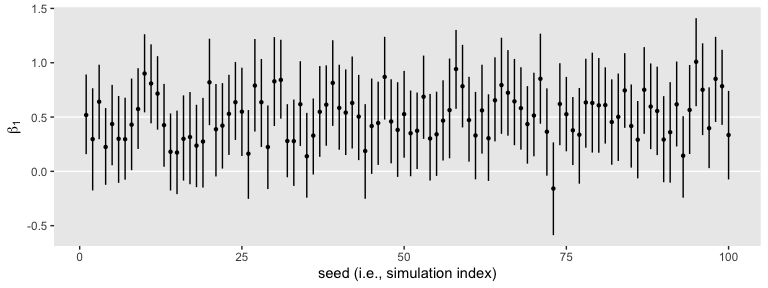
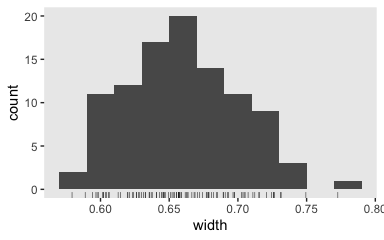

Bayesian power analysis: Part II
================

## tl;dr

There’s more to power analysis–or sample-size planning, at least–than
making sure you can reject a null hypothesis. Bayesians might be
interested in the precision-oriented approach. Stick around to learn
what and
how.

## If all you want to do is reject \(H_0\), why not just drop Bayes altogether?

If you read my last post, you may have found yourself thinking: *Sure,
last time you avoided computing \(p\)-values with your 95% Bayesian
credible intervals. But weren’t you still acting like a NHSTesting
frequentist with all that \(H_0 / H_1\) talk?*

Solid criticism. We didn’t even bother discussing all the type-I versus
type-II error details. Yet they too were lurking in the background the
way we just chose the typical .8 power benchmark. That’s not to say
frequentist null-hypothesis-oriented approaches to sample size planning
aren’t legitimate. They’re certainly congruent with what most reviewers
would expect. But this all seems at odds with a model-oriented Bayesian
approach. Happily, we have other options to explore.

## Let’s just pick up where we left off.

Load our primary statistical packages.

``` r
library(tidyverse)
library(brms)
library(broom)
```

As a recap, here’s how we performed the last simulation-based Bayesian
power analysis from part I. First, we simulated a single data set and
fit an initial model.

``` r
# define the means
mu_c <- 0
mu_t <- .5

# determine the group size
n <- 50

# simulate the data
set.seed(1)
d <-
  tibble(group     = rep(c("control", "treatment"), each = n)) %>% 
  mutate(treatment = ifelse(group == "control", 0, 1),
         y         = ifelse(group == "control", 
                            rnorm(n, mean = mu_c, sd = 1),
                            rnorm(n, mean = mu_t, sd = 1)))
# fit the model
fit <-
  brm(data = d,
      family = gaussian,
      y ~ 0 + intercept + treatment,
      prior = c(prior(normal(0, 2), class = b),
                prior(student_t(3, 1, 1), class = sigma)),
      seed = 1)
```

Next, we made a custom function that both simulated data sets and used
the `update()` function to update that initial fit in order to avoid
additional compilation time.

``` r
sim_d_and_fit <- function(seed, n) {
  
  mu_t <- .5
  mu_c <- 0
  
  set.seed(seed)
  
  d <-
    tibble(group     = rep(c("control", "treatment"), each = n)) %>% 
    mutate(treatment = ifelse(group == "control", 0, 1),
           y         = ifelse(group == "control", 
                              rnorm(n, mean = mu_c, sd = 1),
                              rnorm(n, mean = mu_t, sd = 1)))
  
  update(fit,
         newdata = d, 
         seed = seed) %>% 
    tidy(prob = .95) %>% 
    filter(term == "b_treatment")
}
```

Then we finally iterated over `n_sim <- 100` times.

``` r
n_sim <- 100

s3 <-
  tibble(seed = 1:n_sim) %>% 
  mutate(tidy = map(seed, sim_d_and_fit, n = 50)) %>% 
  unnest(tidy)
```

The results looked like so:

``` r
theme_set(theme_grey() +
            theme(panel.grid = element_blank()))

s3 %>% 
  ggplot(aes(x = seed, y = estimate, ymin = lower, ymax = upper)) +
  geom_hline(yintercept = c(0, .5), color = "white") +
  geom_pointrange(fatten = 1/2) +
  labs(x = "seed (i.e., simulation index)",
       y = expression(beta[1]))
```

<!-- -->

Time to build.

## We might evaluate “power” by widths.

Instead of just ordering the point-ranges by their `seed` values, we
might instead arrange them by the `lower` levels.

``` r
s3 %>%
  ggplot(aes(x = reorder(seed, lower), y = estimate, ymin = lower, ymax = upper)) +
  geom_hline(yintercept = c(0, .5), color = "white") +
  geom_pointrange(fatten = 1/2) +
  scale_x_discrete("reordered by the lower level of the 95% intervals", breaks = NULL) +
  ylab(expression(beta[1])) +
  coord_cartesian(ylim = c(-.5, 1.3))
```

<!-- -->

Notice how this arrangement highlights the differences in widths among
the intervals. Some were wider than others, but all tended to hover in a
similar range. We might quantify those ranges by computing a `width`
variable.

``` r
s3 <-
  s3 %>% 
  mutate(width = upper - lower)

head(s3)
```

    ## # A tibble: 6 x 7
    ##    seed term        estimate std.error   lower upper width
    ##   <int> <chr>          <dbl>     <dbl>   <dbl> <dbl> <dbl>
    ## 1     1 b_treatment    0.518     0.184  0.159  0.892 0.733
    ## 2     2 b_treatment    0.297     0.237 -0.176  0.765 0.941
    ## 3     3 b_treatment    0.641     0.178  0.296  0.982 0.686
    ## 4     4 b_treatment    0.224     0.178 -0.124  0.582 0.706
    ## 5     5 b_treatment    0.436     0.190  0.0560 0.796 0.740
    ## 6     6 b_treatment    0.300     0.206 -0.106  0.694 0.799

Here’s the `width` distribution.

``` r
s3 %>% 
  ggplot(aes(x = width)) +
  geom_histogram(binwidth = .01)
```

<!-- -->

The widths of our 95% intervals range from 0.6 to 0.95, with the bulk
sitting around 0.8. Let’s focus a bit and take a random sample of one of
the models.

``` r
set.seed(1)

s3 %>% 
  sample_n(1) %>% 
  mutate(seed = seed %>% as.character()) %>% 

  ggplot(aes(x = seed, y = estimate, ymin = lower, ymax = upper)) +
  geom_hline(yintercept = c(0, .5), color = "white") +
  geom_pointrange() +
  coord_flip() +
  labs(x = "seed #",
       y = expression(beta[1]))
```

<!-- -->

Though the posterior mean suggests the most probable value for
\(\beta_1\) is about 0.6, the intervals suggest values from about 0.2 to
almost 1 are within the 95% probability range. That’s a wide spread.
Within psychology, a standardized mean difference of 0.2 would typically
be considered small, whereas a difference of 1 would be large enough to
raise a skeptical eyebrow or two.

So instead of fucosing on rejecting a null hypothisis like
\(H_0\text{: } \mu_\text{control} = \mu_\text{treatment}\), we might
instead use our power simulation to determine the sampel size we need to
have most of our 95% intervals come in at a certain level of precision.
This has been termed the accuracy in parameter estimation (AIPE;
[Maxwell, Kelley, & Rausch,
2008](\(https://www3.nd.edu/~kkelley/publications/articles/Maxwell_Kelley_Rausch_2008.pdf\));
see also
[Kruschke, 2014](http://www.indiana.edu/~kruschke/DoingBayesianDataAnalysis/))
approach to sample size planning.

Thinking in terms of AIPE, let’s say we wanted widths of 0.7 or smaller.
Here’s how we did with `s3`.

``` r
s3 %>% 
  mutate(check = ifelse(width < .7, 1, 0)) %>% 
  summarise(`width power` = mean(check))
```

    ## # A tibble: 1 x 1
    ##   `width power`
    ##           <dbl>
    ## 1          0.08

We did terrible. I’m not sure the term “width power” is even a thing.
But hopefully you get the point. Our baby 100-iteration analysis
suggests we have about a .08 probability of achieving 95% CI widths of
0.7 or smaller with \(n = 50\) per group. Though we’re pretty good at
excluding zero, we don’t tend to do so with precision above that.

That last bit about excluding zero brings up an important point. Once
we’re concerned about width size, the null hypothesis is no longer of
direct relevance. And since we’re no longer wed to thinking in terms of
the null hypothesis, there’s no real need to stick with a .8 threshold
for evaluating width power (okay, I’ll stop using that term). Now if we
wanted to stick with .8, we could. Though a little nonsensical, the .8
criterion would give our AIPE analyses a sense of familiarity with
traditional power analyses, which some reviewers might appreciate. But
in his text, Kruschke mentioned several other alternatives. One would be
to set maximum value for our CI widths and simulate to find the \(n\)
necessary so all our simulations pass that criterion. Another would
follow Joseph, Wolfson, and du Berger
([1995a](http://www.medicine.mcgill.ca/epidemiology/Joseph/publications%5CMethodological%5Css_binom.pdf),
[1995b](http://www.med.mcgill.ca/epidemiology/Joseph/publications/Methodological/ss_hpd.pdf)),
who suggested we shoot for an \(n\) that produces widths that pass that
criterion on average. Here’s how we did based on the average-width
criterion.

``` r
s3 %>% 
  summarise(`average width` = mean(width))
```

    ## # A tibble: 1 x 1
    ##   `average width`
    ##             <dbl>
    ## 1           0.784

Close. Let’s see how increasing our sample size to 75 per group effects
these metrics.

``` r
s4 <-
  tibble(seed = 1:n_sim) %>% 
  mutate(tidy = map(seed, sim_d_and_fit, n = 75)) %>% 
  unnest(tidy) %>%
  mutate(width = upper - lower)
```

Here’s what our new batch of 95% intervals looks like.

``` r
s4 %>% 
  ggplot(aes(x = reorder(seed, lower), y = estimate, ymin = lower, ymax = upper)) +
  geom_hline(yintercept = c(0, .5), color = "white") +
  geom_pointrange(fatten = 1/2) +
  scale_x_discrete("reordered by the lower level of the 95% intervals", breaks = NULL) +
  ylab(expression(beta[1])) +
  # this kept the scale on the y-axis the same as the simulation with n = 50
  coord_cartesian(ylim = c(-.5, 1.3))
```

<!-- -->

There’s still diversity among their widths, but they all now hover more
tightly around their true data-generating value of 0.5. Here’s our
updated power for producing interval widths smaller than 0.7.

``` r
s4 %>% 
  mutate(check = ifelse(width < .7, 1, 0)) %>% 
  summarise(`proportion below 0.7` = mean(check),
            `average width`        = mean(width))
```

    ## # A tibble: 1 x 2
    ##   `proportion below 0.7` `average width`
    ##                    <dbl>           <dbl>
    ## 1                   0.94           0.637

If we hold to the NHST-oriented .8 threshold, we did great and are even
“overpowered”. We didn’t quite meet Kruschke’s strict
limiting-worst-precision threshold, but we got close enough we’d have a
good sense of what range of \(n\) values we might evaluate over next. As
far as the mean-precision criterion, we did great by that one and even
beat it by about 0.04.

Here’s a look at how this batch of widths is distributed.

``` r
s4 %>% 
  ggplot(aes(x = width)) +
  geom_histogram(binwidth = .02) +
  geom_rug(size = 1/6)
```

<!-- -->

Let’s see if we can nail down the \(n\)s for our three AIPE criteria.
Since we’re so close to fulfilling Kruschke’s limiting-worst-precision
criterion, we’ll start there. I’m thinking \(n = 85\) should just about
do it.

``` r
s5 <-
  tibble(seed = 1:n_sim) %>% 
  mutate(tidy = map(seed, sim_d_and_fit, n = 85)) %>% 
  unnest(tidy) %>%
  mutate(width = upper - lower)
```

Did we pass?

``` r
s5 %>% 
  mutate(check = ifelse(width < .7, 1, 0)) %>% 
  summarise(`proportion below 0.7` = mean(check))
```

    ## # A tibble: 1 x 1
    ##   `proportion below 0.7`
    ##                    <dbl>
    ## 1                      1

Success\! We might look at how they’re distributed.

``` r
s5 %>% 
  ggplot(aes(x = width)) +
  geom_histogram(binwidth = .01) +
  geom_rug(size = 1/6)
```

<!-- -->

Two of our simulated widths were pretty close to the 0.7 boundary. If we
were to do a proper simulation with 1000+ iterations, I’d worry one or
two would creep over that boundary. So perhaps \(n = 90\) would be a
better candidate. But you get the idea.

If we just wanted to meet the mean-precision criterion, we might look at
something like \(n = 65\).

``` r
s6 <-
  tibble(seed = 1:n_sim) %>% 
  mutate(tidy = map(seed, sim_d_and_fit, n = 65)) %>% 
  unnest(tidy) %>%
  mutate(width = upper - lower)
```

Did we pass?

``` r
s6 %>% 
  summarise(`average width` = mean(width))
```

    ## # A tibble: 1 x 1
    ##   `average width`
    ##             <dbl>
    ## 1           0.686

We got it\! It looks like something like \(n = 65\) would be a good
candidate for a larger-scale simulation. Here’s the distribution.

``` r
s6 %>% 
  ggplot(aes(x = width)) +
  geom_histogram(binwidth = .025) +
  geom_rug(size = 1/6)
```

<!-- -->

For our final possible criterion, just get .8 of the widths below the
threshold, we’ll want an \(n\) somewhere between 65 and 85. 70, perhaps?

``` r
s7 <-
  tibble(seed = 1:n_sim) %>% 
  mutate(tidy = map(seed, sim_d_and_fit, n = 70)) %>% 
  unnest(tidy) %>%
  mutate(width = upper - lower)
```

Did we pass?

``` r
s7 %>% 
  mutate(check = ifelse(width < .7, 1, 0)) %>% 
  summarise(`proportion below 0.7` = mean(check))
```

    ## # A tibble: 1 x 1
    ##   `proportion below 0.7`
    ##                    <dbl>
    ## 1                   0.82

Yep. Here’s the distribution.

``` r
s7 %>% 
  ggplot(aes(x = width)) +
  geom_histogram(binwidth = .025) +
  geom_rug(size = 1/6)
```

<!-- -->

## How are we defining our widths?

In frequentist analyses, we typically work with 95% confidence intervals
because of their close connection to the conventional \(p < .05\)
threshold. Another consequence of dropping our focus on rejecting
\(H_0\) is that it no longer seems necessary to evaluate our posteriors
with 95% intervals. And as it turns out, some Bayesians aren’t fans of
the 95% interval. McElreath, for example, defiantly used 89% intervals
in his [text](http://xcelab.net/rm/statistical-rethinking/) and Gelman
has
[blogged](https://statmodeling.stat.columbia.edu/2016/11/05/why-i-prefer-50-to-95-intervals/)
on his fondness for 50% intervals.

That in mind, let’s evaluate an \(n\) based on 50% intervals. This will
require us to update our `sim_d_and_fit()` function to allow us to
change the `prob` setting in the `broom::tidy()` funciton.

``` r
sim_d_and_fit <- function(seed, n, prob) {
  
  mu_t <- .5
  mu_c <- 0
  
  set.seed(seed)
  
  d <-
    tibble(group     = rep(c("control", "treatment"), each = n)) %>% 
    mutate(treatment = ifelse(group == "control", 0, 1),
           y         = ifelse(group == "control", 
                              rnorm(n, mean = mu_c, sd = 1),
                              rnorm(n, mean = mu_t, sd = 1)))
  
  update(fit,
         newdata = d, 
         seed = seed) %>% 
    tidy(prob = prob) %>% 
    filter(term == "b_treatment")
}
```

Now simulate to examine those 50% intervals. We’ll start with the
original \(n = 50\)

``` r
n_sim <- 100

s8 <-
  tibble(seed = 1:n_sim) %>% 
  mutate(tidy = map(seed, sim_d_and_fit, n = 50, prob = .5)) %>% 
  unnest(tidy) %>% 
  mutate(width = upper - lower)
```

Here is the distribution of our 50% interval widths.

``` r
s8 %>% 
  mutate(width = upper - lower) %>% 
  
  ggplot(aes(x = width)) +
  geom_histogram(binwidth = .01) +
  geom_rug(size = 1/6)
```

<!-- -->

Since we’ve gone from 95% to 50% intervals, it should be no surprise
that their widths are substantially more narrow. Accordingly, we should
evaluate then with a higher standard. Perhaps it’s more reasonable to
ask for an average width of 0.1. Let’s see how close \(n = 100\) gets
us.

``` r
s9 <-
  tibble(seed = 1:n_sim) %>% 
  mutate(tidy = map(seed, sim_d_and_fit, n = 150, prob = .5)) %>% 
  unnest(tidy) %>% 
  mutate(width = upper - lower)
```

Look at the distribution.

``` r
s9 %>% 
  ggplot(aes(x = width)) +
  geom_histogram(binwidth = .0025) +
  geom_rug(size = 1/6)
```

<!-- -->

Nope, we’re not there yet. Perhaps \(n = 200\) or \(250\) is the ticket.
You get the idea. Anyway, once we’re talking that
AIPE/precision/interval-width talk, we can get all kinds of creative
with which intervals we’re even interested in. As far as I can tell, the
topic is wide open for fights and collaborations between statisticians,
methodologists, and substantive researchers to find sensible ways
forward.

Maybe you should write a dissertation on it.

Regardless, stay tuned for part III where we’ll liberate ourselves from
the tyranny of the Gauss.

## Session info

``` r
sessionInfo()
```

    ## R version 3.6.0 (2019-04-26)
    ## Platform: x86_64-apple-darwin15.6.0 (64-bit)
    ## Running under: macOS High Sierra 10.13.6
    ## 
    ## Matrix products: default
    ## BLAS:   /Library/Frameworks/R.framework/Versions/3.6/Resources/lib/libRblas.0.dylib
    ## LAPACK: /Library/Frameworks/R.framework/Versions/3.6/Resources/lib/libRlapack.dylib
    ## 
    ## locale:
    ## [1] en_US.UTF-8/en_US.UTF-8/en_US.UTF-8/C/en_US.UTF-8/en_US.UTF-8
    ## 
    ## attached base packages:
    ## [1] stats     graphics  grDevices utils     datasets  methods   base     
    ## 
    ## other attached packages:
    ##  [1] broom_0.5.2     brms_2.9.0      Rcpp_1.0.1      forcats_0.4.0  
    ##  [5] stringr_1.4.0   dplyr_0.8.1     purrr_0.3.2     readr_1.3.1    
    ##  [9] tidyr_0.8.3     tibble_2.1.3    ggplot2_3.2.0   tidyverse_1.2.1
    ## 
    ## loaded via a namespace (and not attached):
    ##  [1] nlme_3.1-139          matrixStats_0.54.0    xts_0.11-2           
    ##  [4] lubridate_1.7.4       threejs_0.3.1         httr_1.4.0           
    ##  [7] rstan_2.18.2          tools_3.6.0           backports_1.1.4      
    ## [10] utf8_1.1.4            R6_2.4.0              DT_0.7               
    ## [13] lazyeval_0.2.2        colorspace_1.4-1      withr_2.1.2          
    ## [16] prettyunits_1.0.2     processx_3.3.1        tidyselect_0.2.5     
    ## [19] gridExtra_2.3         Brobdingnag_1.2-6     compiler_3.6.0       
    ## [22] cli_1.1.0             rvest_0.3.4           xml2_1.2.0           
    ## [25] shinyjs_1.0           labeling_0.3          colourpicker_1.0     
    ## [28] scales_1.0.0          dygraphs_1.1.1.6      mvtnorm_1.0-11       
    ## [31] callr_3.2.0           ggridges_0.5.1        StanHeaders_2.18.1-10
    ## [34] digest_0.6.19         rmarkdown_1.13        base64enc_0.1-3      
    ## [37] pkgconfig_2.0.2       htmltools_0.3.6       htmlwidgets_1.3      
    ## [40] rlang_0.4.0           readxl_1.3.1          rstudioapi_0.10      
    ## [43] shiny_1.3.2           generics_0.0.2        zoo_1.8-6            
    ## [46] jsonlite_1.6          crosstalk_1.0.0       gtools_3.8.1         
    ## [49] inline_0.3.15         magrittr_1.5          loo_2.1.0            
    ## [52] bayesplot_1.7.0       Matrix_1.2-17         fansi_0.4.0          
    ## [55] munsell_0.5.0         abind_1.4-5           stringi_1.4.3        
    ## [58] yaml_2.2.0            pkgbuild_1.0.3        plyr_1.8.4           
    ## [61] grid_3.6.0            parallel_3.6.0        promises_1.0.1       
    ## [64] crayon_1.3.4          miniUI_0.1.1.1        lattice_0.20-38      
    ## [67] haven_2.1.0           hms_0.4.2             zeallot_0.1.0        
    ## [70] ps_1.3.0              knitr_1.23            pillar_1.4.1         
    ## [73] igraph_1.2.4.1        markdown_1.0          shinystan_2.5.0      
    ## [76] codetools_0.2-16      reshape2_1.4.3        stats4_3.6.0         
    ## [79] rstantools_1.5.1      glue_1.3.1            evaluate_0.14        
    ## [82] modelr_0.1.4          vctrs_0.1.0           httpuv_1.5.1         
    ## [85] cellranger_1.1.0      gtable_0.3.0          assertthat_0.2.1     
    ## [88] xfun_0.8              mime_0.7              xtable_1.8-4         
    ## [91] coda_0.19-2           later_0.8.0           rsconnect_0.8.13     
    ## [94] shinythemes_1.1.2     bridgesampling_0.6-0
