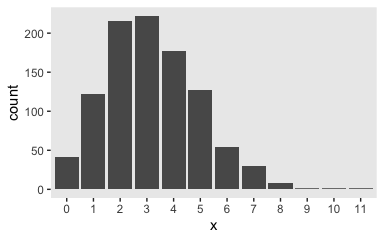
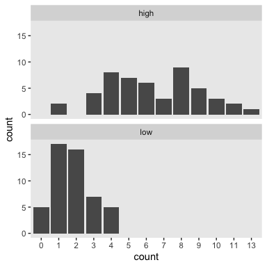
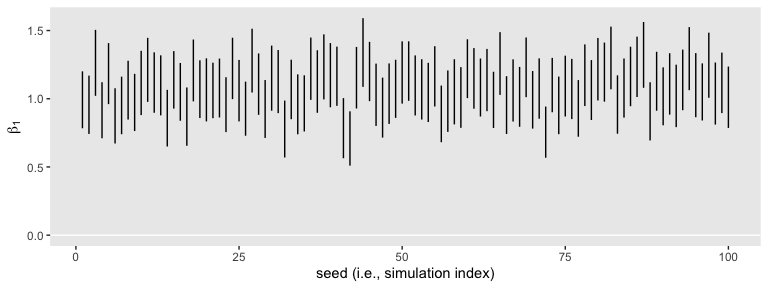
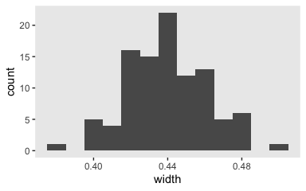
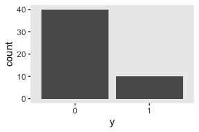
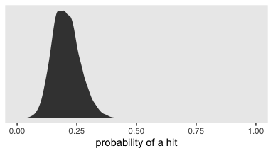
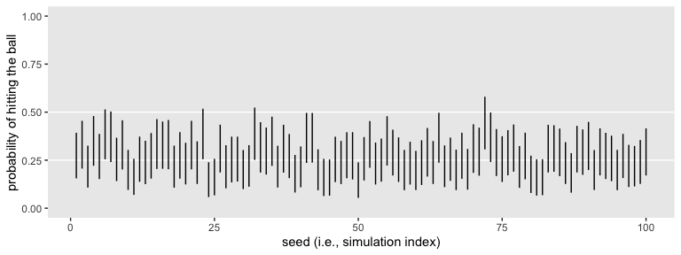
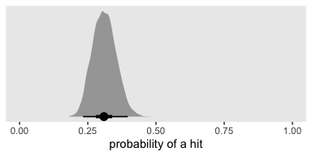
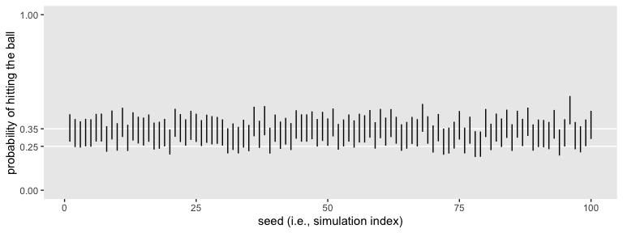

Bayesian power analysis: Part III
================

## tl;dr

So far we’ve covered Bayesian power simulations from both a null
hypothesis orientation and a parameter width perspective. In both
instances, we kept things simple and stayed with Gaussian (i.e.,
normally distributed) data. But not all data follow that form, so it
might do us well to expand our skill set a bit. In this post, we’ll
cover how we might perform power simulations with count and binary data.
For the count data, we’ll use the Poisson likelihood. For the binary,
we’ll use the binomial.

## The Poisson distribution is handy for counts.

In the social sciences, count data arise when we ask questions like:

  - How many sexual partners have you had?
  - How many pets do you have at home?
  - How many cigarettes did you smoke, yesterday?

The values these data will take are discrete \[1\] in that you’ve either
slept with 9 or 10 people, but definitely not 9.5. The values cannot go
below zero in that even if you quit smoking cold turkey 15 years ago and
have been a health nut since, you still could not have smoked -3
cigarettes, yesterday. Zero is as low as it goes.

The canonical distribution for data of this type–non-zero integers–is
the Poisson. It’s named after the French mathematician Siméon Denis
Poisson, [who had quite the confident stare in his
youth](https://upload.wikimedia.org/wikipedia/commons/e/e8/E._Marcellot_Siméon-Denis_Poisson_1804.jpg).
The Poisson distribution has one parameter, \(\lambda\), which controls
both its mean and variance. Although the numbers the Poisson describes
are counts, the \(\lambda\) parameter does not need to be an integer.
For example, here’s the plot of 1000 draws from a Poisson for which
\(\lambda = 3.2\).

``` r
library(tidyverse)

theme_set(theme_gray() + theme(panel.grid = element_blank()))

tibble(x = rpois(n = 1e3, lambda = 3.2)) %>% 
  mutate(x = factor(x)) %>% 
  
  ggplot(aes(x = x)) +
  geom_bar()
```

<!-- -->

In case you missed it, the key function for generating those data was
`rpois()`. I’m not going to go into a full-blown tutorial on the Poisson
distribution or on count regression. For more thorough introductions,
check out Atkins et al’s [*A tutorial on count regression and
zero-altered count models for longitudinal substance use
data*](https://www.ncbi.nlm.nih.gov/pmc/articles/PMC3513584/pdf/nihms396181.pdf),
chapters 9 through 11 in McElreath’s [*Statistical
Rethinking*](https://xcelab.net/rm/statistical-rethinking/), or, if you
really want to dive in, Agresti’s [*Foundations of Linear and
Generalized Linear
Models*](https://www.wiley.com/en-us/Foundations+of+Linear+and+Generalized+Linear+Models-p-9781118730034).

For our power example, let’s say you were interested in drinking. Using
data from [the National Epidemiologic Survey on Alcohol and Related
Conditions](https://pubs.niaaa.nih.gov/publications/AA70/AA70.htm),
Christopher Ingraham presented [a data
visualization](https://www.washingtonpost.com/news/wonk/wp/2014/09/25/think-you-drink-a-lot-this-chart-will-tell-you/?utm_term=.b81599bbbe25)
of the average number of alcoholic drinks American adults consume, per
week. By decile, the numbers were:

1.  0.00
2.  0.00
3.  0.00
4.  0.02
5.  0.14
6.  0.63
7.  2.17
8.  6.25
9.  15.28
10. 73.85

Let’s say you wanted to run a study where you planned on comparing two
demographic groups by their weekly drinking levels. Let’s further say
you suspected one of those groups drank like the folks American adults
in the 7<sup>th</sup> decile and the other drank like American adults in
the 8<sup>th</sup>. We’ll call them low and high drinkers, respectively.
For convenience, let’s further presume you’ll be able to recruit equal
numbers of participants from both groups. The question for our power
analysis is to determine how many you’d need per group to detect
reliable differences. Using \(n = 50\) as a starting point, here’s what
the data for our hypothetical groups might look like.

``` r
mu_7 <- 2.17
mu_8 <- 6.25

n <- 50

set.seed(3)

d <-
  tibble(low  = rpois(n = n, lambda = mu_7),
         high = rpois(n = n, lambda = mu_8)) %>% 
  gather(group, count) 

d %>%
  mutate(count = factor(count)) %>% 
  
  ggplot(aes(x = count)) +
  geom_bar() +
  facet_wrap(~group, ncol = 1)
```

<!-- -->

This will be our primary data type. Our next step is to determine how to
express our research question as a regression model. Like with our
two-group Gaussian models, we can predict counts in terms of an
intercept (i.e., standing for the expected value on the reference group)
and slope (i.e., standing for the expected difference between the
reference group and the comparison group). If we coded our two groups by
a `high` variable for which 0 stood for low drinkers and 1 stood for
high drinkers, the basic model would follow the form

\[
\begin{align*}
\text{drinks_per_week}_i & \sim \text{Poisson}(\lambda_i) \\
\text{log} (\lambda_i)   & = \beta_0 + \beta_1 \text{high}_i.
\end{align*}
\]

Here’s how to set the data up for that model.

``` r
d <-
  d %>% 
  mutate(high = ifelse(group == "low", 0, 1))
```

If you were attending closely to our model formula, you noticed we ran
into a detail. Count regression, such as with the Poisson likelihood,
tends to use the log link. *Why?* you ask. Recall that counts need to be
0 and above. Same deal for our \(\lambda\) parameter. In order to make
sure our models don’t yield silly estimates for \(\lambda\), like -2 or
something, we typically use the log link. You don’t have to, of course.
[The world is your
playground](https://i.kym-cdn.com/entries/icons/original/000/008/342/ihave.jpg).
But this is the method most of your colleagues are likely to use and
it’s the one I suggest you use until you have compelling reasons to do
otherwise.

So then since we’re now fitting a model with a log link, it might seem
challenging to pick good priors. As a place to start, we can use the
`brms::get_prior()` function to see the **brms** defaults.

``` r
library(brms)

get_prior(data = d,
          family = poisson,
          count ~ 0 + intercept + high)
```

    ##   prior class      coef group resp dpar nlpar bound
    ## 1           b                                      
    ## 2           b      high                            
    ## 3           b intercept

Hopefully two things popped out. First, there’s no prior of `class =
sigma`. Since the Poisson distribution only has one parameter
\(\lambda\), we don’t need to set a prior for \(\sigma\). Our model
won’t have one. Second, because we’re continuing to use the `0 +
intercept` syntax for our model intercept, both our intercept and slope
are of prior `class = b` and those currently have default flat priors
with **brms**. To be sure, flat priors aren’t the best. But maybe if
this was your first time playing around with a Poisson model, default
flat priors might seem like a safe place to start. [Feel free to
disagree](https://xkcd.com/386/). In the meantime, here’s how to fit
that default Poisson model with `brms::brm()`.

``` r
fit1 <-
  brm(data = d,
      family = poisson,
      count ~ 0 + intercept + high,
      seed = 3)
```

``` r
print(fit1)
```

    ##  Family: poisson 
    ##   Links: mu = log 
    ## Formula: count ~ 0 + intercept + high 
    ##    Data: d (Number of observations: 100) 
    ## Samples: 4 chains, each with iter = 2000; warmup = 1000; thin = 1;
    ##          total post-warmup samples = 4000
    ## 
    ## Population-Level Effects: 
    ##           Estimate Est.Error l-95% CI u-95% CI Eff.Sample Rhat
    ## intercept     0.59      0.11     0.37     0.81        984 1.00
    ## high          1.27      0.12     1.02     1.50       1003 1.00
    ## 
    ## Samples were drawn using sampling(NUTS). For each parameter, Eff.Sample 
    ## is a crude measure of effective sample size, and Rhat is the potential 
    ## scale reduction factor on split chains (at convergence, Rhat = 1).

Since we used the log link, our model results are in the log metric,
too. If you’d like them in the metric of the data, you’d work directly
with the poster samples and exponentiate.

``` r
post <- 
  posterior_samples(fit1) %>% 
  mutate(`beta_0 (i.e., low)`                       = exp(b_intercept),
         `beta_1 (i.e., difference score for high)` = exp(b_high))
```

We can then just summarize our parameters of interest.

``` r
post %>% 
  select(starts_with("beta_")) %>% 
  gather() %>% 
  group_by(key) %>% 
  summarise(mean  = mean(value),
            lower = quantile(value, prob = .025),
            upper = quantile(value, prob = .975))
```

    ## # A tibble: 2 x 4
    ##   key                                       mean lower upper
    ##   <chr>                                    <dbl> <dbl> <dbl>
    ## 1 beta_0 (i.e., low)                        1.81  1.45  2.24
    ## 2 beta_1 (i.e., difference score for high)  3.58  2.78  4.50

For the sake of simulation, it’ll be easier if we press on with
evaluating the parameters on the log metric, though. If you’re working
within a null-hypothesis oriented power paradigm, you’ll be happy to
know zero is still the number to beat for evaluating our 95% intervals
for \(\beta_1\), even when that parameter is in the log metric. Here it
is, again.

``` r
library(broom)

tidy(fit1, prob = .95) %>% 
  filter(term == "b_high")
```

    ##     term estimate std.error   lower    upper
    ## 1 b_high 1.266527 0.1232635 1.02143 1.504801

So our first fit suggests we’re on good footing to run a quick power
simulation holding \(n = 50\). As in the prior blog posts, our lives
will be simpler if we set up a custom simulation function. Since we’ll
be using it to simulate the data and fit the model in one step, let’s
call it `sim_data_fit()`.

``` r
sim_data_fit <- function(seed, n) {
  
  n <- n
  
  set.seed(seed)
  
  d <-
    tibble(high  = rep(0:1, each = n),
           count = c(rpois(n = n, lambda = mu_7),
                     rpois(n = n, lambda = mu_8)))
  
  update(fit1,
         newdata = d,
         seed = seed) %>% 
  tidy(prob = .95) %>% 
  filter(term == "b_high") %>% 
  select(lower:upper)
  
}
```

Here’s the simulation for a simple 100 iterations.

``` r
sim1 <-
  tibble(seed = 1:100) %>% 
  mutate(ci = map(seed, sim_data_fit, n = 50)) %>% 
  unnest()
```

That went quick–less than 3 minutes on my old laptop. Here’s what those
100 \(\beta_1\) intervals look like in bulk.

``` r
sim1 %>% 
  
  ggplot(aes(x = seed, ymin = lower, ymax = upper)) +
  geom_hline(yintercept = 0, color = "white") +
  geom_linerange() +
  labs(x = "seed (i.e., simulation index)",
       y = expression(beta[1]))
```

<!-- -->

None of them are anywhere near the null value 0. So it appears we’re
well above .8 power to reject the typical \(H_0\) with \(n = 50\).
Here’s the distribution of their widths.

``` r
sim1 %>% 
  mutate(width = upper - lower) %>% 
  
  ggplot(aes(x = width)) +
  geom_histogram(binwidth = .01)
```

<!-- -->

What if we wanted a mean width of 0.25 on the log scale? We might try
the simulation with \(n = 150\).

``` r
sim2 <-
  tibble(seed = 1:100) %>% 
  mutate(ci = map(seed, sim_data_fit, n = 150)) %>% 
  unnest()
```

Here we’ll summarize the widths both in terms of their mean and what
proportion were smaller than 0.25.

``` r
sim2 %>% 
  mutate(width = upper - lower) %>% 
  summarise(`mean width` = mean(width),
            `below 0.25` = mean(width < 0.25))
```

    ## # A tibble: 1 x 2
    ##   `mean width` `below 0.25`
    ##          <dbl>        <dbl>
    ## 1        0.253          0.4

If we wanted to focus on the mean, we did pretty good. Perhaps set the
\(n = 155\) and simulate a full 1000+ iterations for a serious power
analysis. But if we wanted to make the stricter criteria of all below
0.25, we’d need to up the \(n\) quite a bit more. And of course, once
you have a little experience working with Poisson models, you might do
the power simulations with more ambitious priors. For example, if your
count values are lower than like 1000, there’s a good chance a
`normal(0, 6)` prior on your \(\beta\) parameters will be nearly flat
within the reasonable neighborhoods of the parameter space.

Now you’ve got a sense of how to work with the Poisson likelihood, it’s
time to move on to the binomial.

## The binomial is handy for binary data.

Binary data are even weirder than counts. They typically only take on
two values: 0 and 1. Sometimes 0 is a stand-in for “no” and 1 for “yes”
(e.g., *Are you an expert in Bayesian power analysis?* For me that would
be `0`). You can also have data of this kind if you asked people whether
they’d like to choose option A or B. With those kinds of data, you might
code A as 0 and B as 1. Binomial data also often stand in for trials
where 0 = “fail” and 1 = “success.” For example, if you answered “Yes”
to the question *Are all data normally distributed?* we’d mark your
answer down as a `0`.

Though 0s and 1s are popular, sometimes binomial data appear in their
aggregated form. Let’s say I gave you 10 algebra questions and you got 7
of them right. Here’s one way to encode those data.

``` r
n <- 10
z <- 7

rep(0:1, times = c(n - z, z))
```

    ##  [1] 0 0 0 1 1 1 1 1 1 1

In that example, `n` stood for the total number of trials and `z` was
the number you got correct (i.e., the number of times we encoded your
response as a 1). A more compact way to encode that data is with two
columns, one for `z` and the other for `n`.

``` r
tibble(z = z,
       n = n)
```

    ## # A tibble: 1 x 2
    ##       z     n
    ##   <dbl> <dbl>
    ## 1     7    10

So then if you gave those same 10 questions to four of your friends, we
could encode the results like this.

``` r
set.seed(3)

tibble(id = letters[1:5],
       z  = rpois(n = 5, lambda = 5),
       n  = n)
```

    ## # A tibble: 5 x 3
    ##   id        z     n
    ##   <chr> <int> <dbl>
    ## 1 a         3    10
    ## 2 b         7    10
    ## 3 c         4    10
    ## 4 d         4    10
    ## 5 e         5    10

If you’re `b`, it appears you’re the smart one in the group.

Anyway, whether working with binomial or aggregated binomial data, we’re
interested in the probability a given trial will be 1.

### Logistic regression with binary data.

Taking binary data as a starting point, given \(d\) data that includes a
variable \(y\) where the value in the \(i^\text{th}\) row is a 0 or a 1,
we’d like to know \(p(y_i = 1 | d)\). The binomial distribution will
help us get that estimate for \(p\). We’ll do so within the context of a
logistic regression model following the form

\[
\begin{align*}
y_i                & \sim \text{Binomial} (n = 1, p_i) \\
\text{logit} (p_i) & = \beta_0,
\end{align*}
\]

were the logit function id defined as the log odds

\[
\text{logit} (p_i) = \text{log} \bigg (\frac{p_i}{1 - p_i} \bigg),
\]

and thus

\[
\text{log} \bigg (\frac{p_i}{1 - p_i} \bigg) = \beta_0.
\]

In those formulas, \(\beta_0\) is the intercept. In a binomial model
with no predictors \[2\], the intercept \(\beta_0\) is just the estimate
for \(p\), but in the log-odds metric. So yes, similar to the Poisson
models, we typically use a link function with our binomial models.
Instead of the log link, we use the logit because constrains the
posterior for \(p\) to values between 0 and 1. Just as the null value
for a probability is .5, the null value for the parameters within a
logistic regression model is typically 0.

As above with the Poisson, I’m not going to go into a full-blown
tutorial on the binomial distribution or on logistic regression. For
more thorough introductions, check out chapters 9 through 10 in
McElreath’s [*Statistical
Rethinking*](https://xcelab.net/rm/statistical-rethinking/) or Agresti’s
[*Foundations of Linear and Generalized Linear
Models*](https://www.wiley.com/en-us/Foundations+of+Linear+and+Generalized+Linear+Models-p-9781118730034).

Time to simulate some data. Let’s say we’d like to estimate the
probability someone will hit a ball in a baseball game. Nowadays,
batting averages for professional baseball players tend around .25 (see
[here](http://www.baseball-almanac.com/hitting/hibavg4.shtml)). So if we
wanted to simulate 50 at-bats, we might do so like this.

``` r
set.seed(3)

d <- tibble(y = rbinom(n = 50, size = 1, prob = .25))

str(d)
```

    ## Classes 'tbl_df', 'tbl' and 'data.frame':    50 obs. of  1 variable:
    ##  $ y: int  0 1 0 0 0 0 0 0 0 0 ...

Here are what those data look like in a bar plot.

``` r
d %>% 
  mutate(y = factor(y)) %>% 
  
  ggplot(aes(x = y)) +
  geom_bar()
```

<!-- -->

Here’s the **brms** default for our intercept-only logistic regression
model.

``` r
get_prior(data = d, 
          family = binomial,
          y | trials(1) ~ 1)
```

    ## Intercept ~ student_t(3, 0, 10)

That’s a really liberal prior. We might be a little more gutsy and put a
more skeptical `normal(0, 2)` prior on that intercept. With the context
of our logit link, that still puts a 95% probability that the \(p\) is
between .02 and .98, which is almost the entire parameter space. Here’s
how to fit the model with the `brm()` function.

``` r
fit2 <-
  brm(data = d, 
      family = binomial,
      y | trials(1) ~ 1,
      prior(normal(0, 2), class = Intercept),
      seed = 3)
```

In the `brm()` formula syntax, including a `|` bar on the left side of a
formula indicates we have extra supplementary information about our
criterion variable. In this case, that information is that each `y`
value corresponds to a single trial (i.e., `trials(1)`), which itself
corresponds to the \(n = 1\) portion of the statistical formula, above.
Here are the results.

``` r
print(fit2)
```

    ##  Family: binomial 
    ##   Links: mu = logit 
    ## Formula: y | trials(1) ~ 1 
    ##    Data: d (Number of observations: 50) 
    ## Samples: 4 chains, each with iter = 2000; warmup = 1000; thin = 1;
    ##          total post-warmup samples = 4000
    ## 
    ## Population-Level Effects: 
    ##           Estimate Est.Error l-95% CI u-95% CI Eff.Sample Rhat
    ## Intercept    -1.39      0.36    -2.12    -0.73       1462 1.00
    ## 
    ## Samples were drawn using sampling(NUTS). For each parameter, Eff.Sample 
    ## is a crude measure of effective sample size, and Rhat is the potential 
    ## scale reduction factor on split chains (at convergence, Rhat = 1).

Remember that that intercept is on the scale of the logit link, the log
odds. We can transform it with the `brms::inv_logit_scaled()` function.

``` r
fixef(fit2)["Intercept", 1] %>% 
  inv_logit_scaled()
```

    ## [1] 0.1991036

If we want the full posterior distribution, we’ll need to work with the
posterior draws themselves.

``` r
posterior_samples(fit2) %>% 
  transmute(p = inv_logit_scaled(b_Intercept)) %>% 
  
  ggplot(aes(x = p)) +
  geom_density(fill = "grey25", size = 0) +
  scale_x_continuous("probability of a hit", limits = c(0, 1)) +
  scale_y_continuous(NULL, breaks = NULL)
```

<!-- -->

Looks like the null hypothesis of \(p = .5\) is not credible for this
simulation. If we’d like the posterior median and percentile-based 95%
intervals, we might use the `median_qi()` function from the handy
[**tidybayes** package](https://mjskay.github.io/tidybayes/index.html).

``` r
library(tidybayes)

posterior_samples(fit2) %>% 
  transmute(p = inv_logit_scaled(b_Intercept)) %>% 
  median_qi()
```

    ##           p    .lower    .upper .width .point .interval
    ## 1 0.2011897 0.1076116 0.3252849   0.95 median        qi

Yep, .5 was not within those intervals. Let’s see what happens when we
do a mini power analysis with 100 iterations. First we set up our
simulation function.

``` r
sim_data_fit <- function(seed, n_player) {
  
  n_trials <- 1
  prob_hit <- .25
  
  set.seed(seed)
  
  d <- tibble(y = rbinom(n    = n_player, 
                         size = n_trials, 
                         prob = prob_hit))
  
  update(fit2,
         newdata = d,
         seed = seed) %>% 
  posterior_samples() %>% 
  transmute(p = inv_logit_scaled(b_Intercept)) %>% 
  median_qi() %>% 
    select(.lower:.upper)
  
}
```

Simulate.

``` r
sim3 <-
  tibble(seed = 1:100) %>% 
  mutate(ci = map(seed, sim_data_fit, n_player = 50)) %>% 
  unnest()
```

You might plot the intervals.

``` r
sim3 %>% 
  ggplot(aes(x = seed, ymin = .lower, ymax = .upper)) +
  geom_hline(yintercept = c(.25, .5), color = "white") +
  geom_linerange() +
  xlab("seed (i.e., simulation index)") +
  scale_y_continuous("probability of hitting the ball", limits = c(0, 1))
```

<!-- -->

Like one of my old coworkers used to say: *Purtier ’n a hog\!* Here
we’ll summarize the results both in terms of their conventional power,
their mean width, and the proportion of widths more narrow than .25.
*Why .25?* I don’t know. Without a substantively-informed alternative,
it’s as good a criterion as any.

``` r
sim3 %>% 
  mutate(width = .upper - .lower) %>% 
  summarise(`conventional power` = mean(.upper < .5),
            `mean width`         = mean(width),
            `width below .25`    = mean(width < .25))
```

    ## # A tibble: 1 x 3
    ##   `conventional power` `mean width` `width below .25`
    ##                  <dbl>        <dbl>             <dbl>
    ## 1                 0.95        0.231               0.8

Depending on your study needs, you’d adjust your sample size
accordingly, do a mini simulation or two first, and then follow up with
a proper 1000+ power simulation.

I should point out that whereas we evaluated the power of the Poisson
model with the parameters on the scale of the link function, we
evaluated the power for our logistic regression model after transforming
the intercept back into the probability metric. Both methods are fine.
The way you run your power simulation should be based on how you want to
interpret and report your results.

We should also acknowledge that this was our first example of a power
simulation that wasn’t based on some group comparison. Comparing groups
is fine and normal and important. And it’s also the case that power
matters for more than group-based analyses. Our simulation-based
approach to Bayesian power analyses is fine for both.

### Aggregated binomial regression.

It’s no more difficult to simulate and work with aggregated binomial
data. But since the mechanics for `brms::brm()` and thus the
down-the-road simulation setup are a little different, we should
practice. With our new setup, we’ll consider a new example. Since .25 is
the typical batting average, it might better sense to define the null
hypothesis like this:

\[H_0 \text{: } p = .25\]

Consider a case where we had some intervention where we expected a new
batting average of .35. How many trials would we need, then, to either
reject \(H_0\) or at least estimate \(p\) with a satisfactory degree of
precision? Here’s what the statistical formula for the implied
aggregated binomial model might look like:

\[
\begin{align*}
y_i                & \sim \text{Binomial} (n, p_i) \\
\text{logit} (p_i) & = \beta_0.
\end{align*}
\]

The big change is we no longer defined \(n\) as 1. Let’s say we wanted
our aggregated binomial data set to contain the summary statistics for
\(n = 100\) trials. Here’s what that might look like.

``` r
n_trials <- 100
prob_hit <- .35

set.seed(3)

d <- tibble(n_trials = n_trials,
            y = rbinom(n    = 1, 
                       size = n_trials, 
                       prob = prob_hit))

d
```

    ## # A tibble: 1 x 2
    ##   n_trials     y
    ##      <dbl> <int>
    ## 1      100    32

Now we have two columns. The first, `n_trials`, indicates how many cases
or trials we’re summarizing. The second, `y`, indicates how many
successes/1s/hits we might expect given \(p = .35\). This is the
aggregated binomial equivalent of if we had a 100 row vector composed of
32 1s and 68 0s.

Now, before we discuss fitting the model with **brms**, let’s talk
priors. Since we’ve updated our definition of \(H_0\), it might make
sense to update the prior for \(\beta_0\). As it turns out, setting that
prior to `normal(-1, 0.5)` puts the posterior mode at about .25 on the
probability space, but with fairly wide 95% intervals ranging from about
.12 to .5. Though centered on our updated null value, this prior is
still quite permissive given our hypothesized \(p = .35\).

To fit an aggregated binomial model with the `brm()` function, we
augment the `<criterion> | trials()` syntax where the value that goes in
`trials()` is either a fixed number or variable in the data indexing
\(n\). Our approach will be the latter.

``` r
fit3 <-
  brm(data = d, 
      family = binomial,
      y | trials(n_trials) ~ 1,
      prior(normal(-1, 0.5), class = Intercept),
      seed = 3)
```

Inspect the summary.

``` r
print(fit3)
```

    ##  Family: binomial 
    ##   Links: mu = logit 
    ## Formula: y | trials(n_trials) ~ 1 
    ##    Data: d (Number of observations: 1) 
    ## Samples: 4 chains, each with iter = 2000; warmup = 1000; thin = 1;
    ##          total post-warmup samples = 4000
    ## 
    ## Population-Level Effects: 
    ##           Estimate Est.Error l-95% CI u-95% CI Eff.Sample Rhat
    ## Intercept    -0.81      0.20    -1.19    -0.42       1396 1.00
    ## 
    ## Samples were drawn using sampling(NUTS). For each parameter, Eff.Sample 
    ## is a crude measure of effective sample size, and Rhat is the potential 
    ## scale reduction factor on split chains (at convergence, Rhat = 1).

After a transformation, here’s what that looks like in a plot.

``` r
posterior_samples(fit3) %>% 
  transmute(p = inv_logit_scaled(b_Intercept)) %>% 
  
  ggplot(aes(x = p, y = 0)) +
  geom_halfeyeh(.width = c(.5, .95)) +
  scale_x_continuous("probability of a hit", limits = c(0, 1)) +
  scale_y_continuous(NULL, breaks = NULL)
```

<!-- -->

Based on a single simulation, it looks like \(n = 100\) won’t quite be
enough to reject \(H_0 \text{: } p = .25\) with a conventional 2-sided
95% interval. But it does look like we’re in the ballpark and that our
basic data + model setup will work for a larger-scale simulation. Here’s
an example of how you might update our custom simulation function.

``` r
sim_data_fit <- function(seed, n_trials) {
  
  prob_hit <- .35
  
  set.seed(seed)
  
  d <- tibble(y = rbinom(n    = 1, 
                         size = n_trials, 
                         prob = prob_hit),
              n_trials = n_trials)
  
  update(fit3,
         newdata = d,
         seed = seed) %>% 
  posterior_samples() %>% 
  transmute(p = inv_logit_scaled(b_Intercept)) %>% 
  median_qi() %>% 
    select(.lower:.upper)
  
}
```

Simulate, this time trying out \(n = 120\).

``` r
sim4 <-
  tibble(seed = 1:100) %>% 
  mutate(ci = map(seed, sim_data_fit, n_trials = 120)) %>% 
  unnest()
```

Plot the intervals.

``` r
sim4 %>% 
  ggplot(aes(x = seed, ymin = .lower, ymax = .upper)) +
  geom_hline(yintercept = c(.25, .35), color = "white") +
  geom_linerange() +
  xlab("seed (i.e., simulation index)") +
  scale_y_continuous("probability of hitting the ball",
                     limits = c(0, 1), breaks = c(0, .25, .35, 1))
```

<!-- -->

Overall, those intervals look pretty good. They’re fairly narrow and are
hovering around the data generating \(p = .35\). But it seems many are
still crossing the .25 threshold. Let’s see the results of a formal
summary.

``` r
sim4 %>% 
  mutate(width = .upper - .lower) %>% 
  summarise(`conventional power` = mean(.lower > .25),
            `mean width`         = mean(width),
            `width below .2`     = mean(width < .2))
```

    ## # A tibble: 1 x 3
    ##   `conventional power` `mean width` `width below .2`
    ##                  <dbl>        <dbl>            <dbl>
    ## 1                 0.56        0.155                1

All widths were more narrow than .2 and the mean width was about .16. In
the abstract that might seem reasonably precise. But we’re still not
precise enough to reject \(H_0\) with a conventional power level.
Depending on your needs, adjust the \(n\) accordingly and simulate
again.

## Session info

``` r
sessionInfo()
```

    ## R version 3.6.0 (2019-04-26)
    ## Platform: x86_64-apple-darwin15.6.0 (64-bit)
    ## Running under: macOS High Sierra 10.13.6
    ## 
    ## Matrix products: default
    ## BLAS:   /Library/Frameworks/R.framework/Versions/3.6/Resources/lib/libRblas.0.dylib
    ## LAPACK: /Library/Frameworks/R.framework/Versions/3.6/Resources/lib/libRlapack.dylib
    ## 
    ## locale:
    ## [1] en_US.UTF-8/en_US.UTF-8/en_US.UTF-8/C/en_US.UTF-8/en_US.UTF-8
    ## 
    ## attached base packages:
    ## [1] stats     graphics  grDevices utils     datasets  methods   base     
    ## 
    ## other attached packages:
    ##  [1] tidybayes_1.1.0 broom_0.5.2     brms_2.9.0      Rcpp_1.0.1     
    ##  [5] forcats_0.4.0   stringr_1.4.0   dplyr_0.8.1     purrr_0.3.2    
    ##  [9] readr_1.3.1     tidyr_0.8.3     tibble_2.1.3    ggplot2_3.2.0  
    ## [13] tidyverse_1.2.1
    ## 
    ## loaded via a namespace (and not attached):
    ##  [1] colorspace_1.4-1          ggridges_0.5.1           
    ##  [3] rsconnect_0.8.13          ggstance_0.3.2           
    ##  [5] markdown_1.0              base64enc_0.1-3          
    ##  [7] rstudioapi_0.10           rstan_2.18.2             
    ##  [9] svUnit_0.7-12             DT_0.7                   
    ## [11] fansi_0.4.0               mvtnorm_1.0-11           
    ## [13] lubridate_1.7.4           xml2_1.2.0               
    ## [15] bridgesampling_0.6-0      knitr_1.23               
    ## [17] shinythemes_1.1.2         zeallot_0.1.0            
    ## [19] bayesplot_1.7.0           jsonlite_1.6             
    ## [21] shiny_1.3.2               compiler_3.6.0           
    ## [23] httr_1.4.0                backports_1.1.4          
    ## [25] assertthat_0.2.1          Matrix_1.2-17            
    ## [27] lazyeval_0.2.2            cli_1.1.0                
    ## [29] later_0.8.0               htmltools_0.3.6          
    ## [31] prettyunits_1.0.2         tools_3.6.0              
    ## [33] igraph_1.2.4.1            coda_0.19-2              
    ## [35] gtable_0.3.0              glue_1.3.1               
    ## [37] reshape2_1.4.3            cellranger_1.1.0         
    ## [39] vctrs_0.1.0               nlme_3.1-139             
    ## [41] crosstalk_1.0.0           xfun_0.8                 
    ## [43] ps_1.3.0                  rvest_0.3.4              
    ## [45] mime_0.7                  miniUI_0.1.1.1           
    ## [47] gtools_3.8.1              zoo_1.8-6                
    ## [49] scales_1.0.0              colourpicker_1.0         
    ## [51] hms_0.4.2                 promises_1.0.1           
    ## [53] Brobdingnag_1.2-6         parallel_3.6.0           
    ## [55] inline_0.3.15             shinystan_2.5.0          
    ## [57] yaml_2.2.0                gridExtra_2.3            
    ## [59] loo_2.1.0                 StanHeaders_2.18.1-10    
    ## [61] stringi_1.4.3             dygraphs_1.1.1.6         
    ## [63] pkgbuild_1.0.3            rlang_0.4.0              
    ## [65] pkgconfig_2.0.2           matrixStats_0.54.0       
    ## [67] evaluate_0.14             lattice_0.20-38          
    ## [69] rstantools_1.5.1          htmlwidgets_1.3          
    ## [71] labeling_0.3              tidyselect_0.2.5         
    ## [73] processx_3.3.1            plyr_1.8.4               
    ## [75] magrittr_1.5              R6_2.4.0                 
    ## [77] generics_0.0.2            pillar_1.4.1             
    ## [79] haven_2.1.0               withr_2.1.2              
    ## [81] xts_0.11-2                abind_1.4-5              
    ## [83] modelr_0.1.4              crayon_1.3.4             
    ## [85] arrayhelpers_1.0-20160527 utf8_1.1.4               
    ## [87] rmarkdown_1.13            grid_3.6.0               
    ## [89] readxl_1.3.1              callr_3.2.0              
    ## [91] threejs_0.3.1             digest_0.6.19            
    ## [93] xtable_1.8-4              httpuv_1.5.1             
    ## [95] stats4_3.6.0              munsell_0.5.0            
    ## [97] shinyjs_1.0

## Footnotes

1.  Yes, one can smoke half a cigarette or drink 1/3 of a drink.
    Ideally, we’d have the exact amount of nicotine in your blood at a
    given moment and over time and the same for the amount of alcohol in
    your system relative to your blood volume and such. But in practice,
    substance use researchers just don’t tend to have access to data of
    that quality. Instead, we’re typically stuck with simple counts. And
    I look forward to the day the right team of engineers, computer
    scientists, and substance use researchers (and whoever else I forgot
    to mention) release the cheap, non-invasive technology we need to
    passively measure these things. Until then: *How many standard
    servings of alcohol did you drink, last night?*

2.  In case this is all new to you and you and you had the question in
    your mind: Yes, you can add predictors to the logistic regression
    model. Say we had a model with two predictors, \(x_1\) and \(x_2\).
    Our statistical model would then follow the form
    \(\text{logit} (p_i) = \beta_0 + \beta_1 x_{1i} + \beta_2 x_{2i}\).
